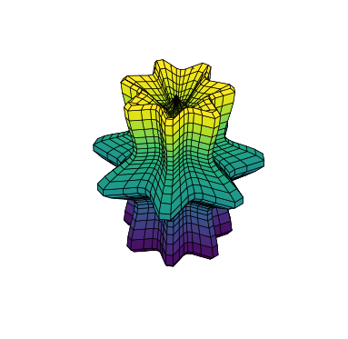
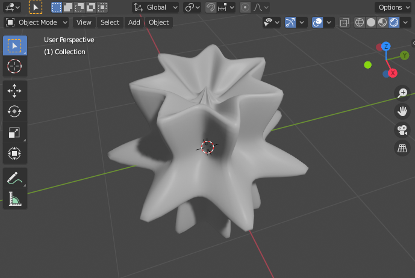

# supershape
Python code to efficiently generate  [3D SuperShapes](https://en.wikipedia.org/wiki/Superformula).

3D SuperShapes are a family of parametric surfaces that can take on a variety of shapes depending on the parametrization. The following snippet creates 3D coordinates of a flower-like object
```python
from supershape import create3d
x,y,z = create3d(
    [7, 1, 1, 0.2, 1.7, 1.7], 
    shape=(50,50)
)
```

<p align="center">
  
</p>

Run
```
python supershape.py
```
to reproduce the above result. See [supershape.py](supershape.py) for details.

### Blender support
Run content of [supershape.py](supershape.py) in Blender (>=v2.8) to get
<p align="center">
  
</p>
